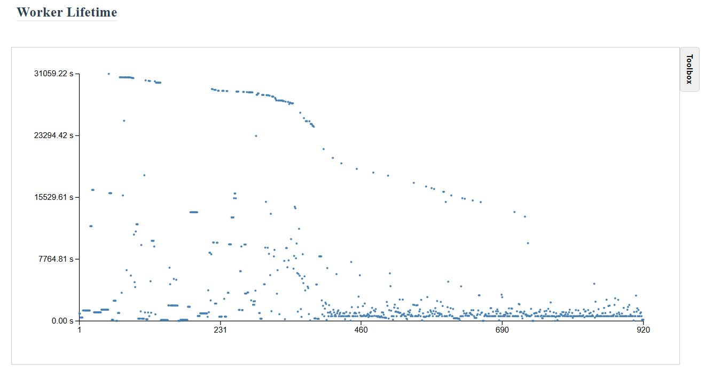

# TaskVine Report Tool

An interactive visualization tool for [TaskVine](https://github.com/cooperative-computing-lab/cctools), a task scheduler for large workflows to run efficiently on HPC clusters. This tool helps you analyze task execution patterns, file transfers, resource utilization, storage consumption, and other key metrics.

## Installation

### For Users (Recommended)

Install directly from PyPI:

```bash
pip install taskvine-report-tool
```

After installation, you can use `vine_parse`, `vine_serve`, and `vine_export` directly from anywhere.

### For Developers

If you want to contribute to development or modify the source code:

```bash
git clone https://github.com/cooperative-computing-lab/taskvine-report-tool.git
cd taskvine-report-tool
pip install -e .
```

## Usage Guide

The tool provides three main commands:

- 🔍 `vine_parse` - Parse TaskVine logs and generate analysis data
- 🌐 `vine_serve` - Start web visualization server
- 📤 `vine_export` - Export report to static PNG and a self-contained HTML file

> **Important:** `vine_serve` and `vine_export` both depend on data generated by `vine_parse` first.
> If `vine_parse` has not been run, required `csv-files` will be missing.

### Command Reference

#### `vine_parse` - Parse TaskVine Logs

**Required Parameters:**
- `--templates`: List of log directory names/patterns (required)

**Optional Parameters:**
- `--logs-dir`: Base directory containing log folders (default: current directory)

**Usage Examples:**

```bash
# Basic usage - parse specific log directories (--templates is required)
vine_parse --templates experiment1 experiment2

# Use glob patterns to match multiple directories
vine_parse --templates exp* test* checkpoint_*

# Specify a different logs directory
vine_parse --logs-dir /path/to/logs --templates experiment1

# Parse directories matching patterns in a specific directory
vine_parse --logs-dir /home/user/logs --templates workflow_* test_*
```

**Default Behavior:**
- If no `--logs-dir` is specified, uses current working directory
- The `--templates` parameter is **required** - the command will fail without it
- Patterns support shell glob expansion (*, ?, [])
- Automatically filters out directories that don't contain `vine-logs` subdirectory

#### `vine_serve` - Start Web Server

**Prerequisite:** run `vine_parse` first so `csv-files` exist.

**All Parameters are Optional:**

- `--logs-dir`: Directory containing log folders (default: current directory)
- `--port`: Port number for the web server (default: 9122)
- `--host`: Host address to bind to (default: 0.0.0.0)

**Usage Examples:**

```bash
# Basic usage - start server with all defaults
vine_serve

# Specify custom port and logs directory
vine_serve --port 8080 --logs-dir /path/to/logs

# Bind to specific host (restrict access)
vine_serve --host 127.0.0.1 --port 9122

# Allow remote access (default behavior)
vine_serve --host 0.0.0.0 --port 9122
```

**Default Behavior:**
- Uses current working directory as logs directory
- Starts server on port 9122
- Binds to all interfaces (0.0.0.0) allowing remote access
- Displays all available IP addresses where the server can be accessed

**HPC Environment Note:**
- `vine_serve` needs permission to bind a listening port.
- On some HPC front-end/login nodes, opening web service ports is restricted by policy.
- If port binding is not allowed, use `vine_export` to generate PNG files and a standalone HTML report for offline viewing/sharing.

**Run Locally on Your Laptop:**
- You can also copy/download log folders from the cluster to your laptop and run `vine_parse` + `vine_serve` locally.
- As long as the directory structure is preserved (especially each run containing `vine-logs`), the tool works the same way on your laptop.
- This is often the easiest workflow when cluster front-end nodes restrict opening ports.

#### `vine_export` - Export Static Report Files

Use this when you want to share results without running a web server.
**Prerequisite:** run `vine_parse` first so `csv-files` exist.

**Required Parameters:**
- One of:
  - `--templates`: List of parsed log directory names/patterns
  - `-R` / `--recursive`: Find all parsed directories under `--logs-dir`

**Common Parameters:**
- `--logs-dir`: Base directory containing parsed logs (default: current directory)
- `--png-dir`: Output root for PNG files (default: `{template}/png-files`)
- `--sections`: Export selected sections only (default: `all`)
- `--dpi`: PNG resolution
- `--width`, `--height`: Canvas size in inches
- `--max-tasks`: Upper bound for task bars in Task Execution Details (default: `100000`)

**Usage Examples:**

```bash
# Export all sections for one template
vine_export --templates experiment1

# Export selected sections only
vine_export --templates experiment1 --sections task-concurrency worker-concurrency

# Export from custom logs directory and write outputs to a custom folder
vine_export --logs-dir /home/user/logs --templates experiment1 --png-dir /tmp/vine-export
```

**What gets generated:**
- `png-files/`: one PNG per selected section
- `html-files/<template>.html`: a single, self-contained HTML report with all images embedded (base64), ready to share

## Quick Start

Follow these steps to use the visualization tool:

### 1. Navigate to Your Log Directory

After running your TaskVine workflow, the logs are automatically saved in the `vine-run-info` directory within your workflow's working directory. Navigate to this directory:

```bash
cd your_workflow_directory/vine-run-info
```

You'll see a structure like this containing your experiment runs:

```
vine-run-info/
├── experiment1/
│   └── vine-logs/
│       ├── debug
│       ├── performance
│       ├── taskgraph
│       ├── transactions
│       └── workflow.json
├── experiment2/
│   └── vine-logs/
└── test_run/
    └── vine-logs/
```

### 2. Parse and Visualize

From within the `vine-run-info` directory:

1. Parse specific experiments (**--templates is required**):
```bash
vine_parse --templates experiment1 experiment2
```

Or parse all experiments matching a pattern:
```bash
vine_parse --templates exp* test_*
```

2. Start the visualization server:
```bash
vine_serve
```

3. View the interactive report in your browser at `http://localhost:9122`

4. (Optional) Export static files for sharing:
```bash
vine_export --templates experiment1
```
This produces PNG files plus one standalone HTML report you can send directly.

Note: In the web interface, you'll only see log collections that have been successfully processed by `vine_parse`.
The same prerequisite applies to `vine_export`.

Tip: If your cluster node cannot host `vine_serve`, copy `vine-run-info/` (or selected run folders with `vine-logs`) to your laptop and run the same commands locally.

### 2. Working with Different Log Directories

If your logs are in a different location, you can specify the base directory containing your log folders using `--logs-dir`:

```bash
# If your logs are in a custom location:
# /home/user/custom_logs/
# ├── experiment1/vine-logs/
# ├── experiment2/vine-logs/
# └── test_run/vine-logs/

# Parse specific experiments from custom location
vine_parse --logs-dir /home/user/custom_logs --templates experiment1 experiment2

# Parse all experiments matching pattern from custom location
vine_parse --logs-dir /home/user/custom_logs --templates exp* test*
```

### 3. Customizing TaskVine Log Location

By default, TaskVine creates a `vine-run-info` directory in your working directory. You can customize this location when creating your TaskVine manager:

```python
manager = vine.Manager(
    9123,
    run_info_path="~/my_analysis_directory",     # Path to your analysis directory
    run_info_template="your_workflow_name"       # Name for this run's logs
)
```

This will automatically create the correct directory structure:
```
~/my_analysis_directory/
└── your_workflow_name/
    └── vine-logs/
        ├── debug
        └── transactions
```

After your workflow completes, simply:
1. Navigate to your analysis directory: `cd ~/my_analysis_directory`
2. Parse the logs: `vine_parse --templates your_workflow_name`
3. Start the server: `vine_serve`
4. View at `http://localhost:9122`

### 4. Generated Data Structure

For most users, the key thing to verify is the `vine-logs` content:
```text
vine-run-info/
└── experiment1/
    ├── vine-logs/          # Required input logs
    │   ├── debug
    │   ├── performance
    │   ├── taskgraph
    │   ├── transactions
    │   └── workflow.json
    ├── pkl-files/          # Auto-generated by vine_parse
    ├── csv-files/          # Auto-generated; required by vine_serve/vine_export
    ├── png-files/          # Auto-generated by vine_export
    ├── html-files/         # Auto-generated by vine_export
    └── svg-files/          # Auto-generated cache
```

As long as `vine-logs` contains the files above, the other directories are managed by the tool.

## Important Notes

1. Ensure correct log folder structure with the required `vine-logs` subdirectory
2. Each log collection must contain complete log files (debug and transactions)
3. Data generation may take some time, especially for large workflows
4. Ensure sufficient disk space for generated data files
5. For workflows with large task graphs, the initial data generation and graph visualization might take significant time (potentially hours on some machines). However, once processed, the results are cached in the `pkl-files` directory, making subsequent loads much faster.

## Features

The tool provides several interactive features to enhance user experience and facilitate detailed analysis:

### Interactive Visualization
- **Zoom**: Use your trackpad or hold Ctrl and scroll with your mouse to zoom in/out. This is especially useful when you have lots of tasks and want to focus on a particular area.
  

- **Hover**: Hover over any point or line to see its details. This helps you quickly find slow or failed tasks and check their logs. Other elements will fade out to help you focus.
  

- **Legend**: Use the checkboxes to show only the data you care about. Mix and match different types of information to create your own view. Click on worker names in the legend to show or hide their data. This helps you focus on specific workers without getting distracted by others.
  

- **Toolbox** Use the toolbox to customize your plot:
  - Save your charts in different formats:
    - Vector formats (SVG, PDF) - great for papers and reports
    - Image formats (PNG, JPG) - perfect for sharing online
  - Download the raw data as CSV files to:
    - Make your own charts
    - Do your own analysis
    - Use with other tools
  - Adjust the axes:
    - Set your own X and Y axis ranges
    - Focus on specific parts of the data
    - Make the chart look exactly how you want
  

## Visualization Modules

The tool provides various visualization modules to analyze different aspects of your TaskVine workflow. Here's a brief description of each module:

The list below reflects sections that are enabled in the current front-end by default.

### Task Analysis
- **Task Execution Details**: Comprehensive visualization of task distribution across workers and cores. Each task undergoes three phases: committing (input preparation and process initialization), execution (actual task processing), and retrieval (output transfer to manager). The visualization also tracks task failures, which may occur due to invalid inputs, worker disconnections, or resource exhaustion. Additionally, it monitors recovery tasks that are automatically submitted to handle file losses caused by worker evictions or crashes.
  
- **Task Concurrency**: Visualizes task states over time from the manager's perspective, tracking five distinct states: waiting (committed but not dispatched), committing (dispatched but not yet executed), executing (currently running on workers), waiting retrieval (completed with outputs pending retrieval), and done (fully completed, whether succeeded or failed).
  
- **Task Response Time**: Measures the duration between task commitment to the manager and its dispatch to a worker. High response times may indicate task queue congestion or scheduler inefficiencies when available cores are significantly outnumbered by waiting tasks.
  
- **Task Execution Time**: Displays the actual runtime duration of each task, providing insights into computational performance and resource utilization.
  
- **Task Retrieval Time**: Tracks the time required to retrieve task outputs, beginning when a task completes and sends its completion message to the manager. This phase ends when outputs are successfully retrieved or an error is identified.
  

### Worker Analysis
- **Worker Storage Consumption**: Monitors the actual storage usage of each worker over time, specifically tracking worker cache consumption. Note that this metric excludes task-related sandboxes as they represent virtual resource allocation.
  
- **Worker Concurrency**: Tracks the number of active workers over time, providing insights into cluster utilization and scalability.
  
- **Worker Incoming Transfers**: Shows the number of file download requests received by each worker over time. These transfers occur when other workers need files from this worker or when the manager is retrieving task outputs.
  
- **Worker Outgoing Transfers**: Displays the number of file download requests initiated by each worker over time, including transfers from the cloud, other workers, or the manager.
  
- **Worker Executing Tasks**: Tracks the number of tasks actively running on each worker over time.
  
- **Worker Lifetime**: Visualizes the active period of each worker throughout the workflow, accounting for varying connection times and potential crashes.
  

### File Analysis
- **File Sizes**: Displays the size of each task-related file, including both input and output files.
  
- **File Concurrent Replicas**: Shows the maximum number of file replicas at any given time. Higher values indicate better redundancy and fault tolerance. Replication occurs automatically for temporary files when specified by the manager's `temp-replica-count` parameter, or naturally when workers fetch inputs from other workers.
  
- **File Retention Time**: Measures the duration between file creation and removal from the cluster. Longer retention times provide better redundancy but consume more disk space. This can be optimized through the manager's file pruning feature.
  
- **File Transferred Size**: Tracks the cumulative size of data transferred between workers over time.
  
- **File Created Size**: Shows the cumulative size of distinct files created during workflow execution.
  

## Troubleshooting

### Common Issues

If you encounter other issues:
1. Verify the log folder structure is correct
2. Confirm all required Python packages are properly installed
3. Check if log files are complete and not corrupted. Note that this tool can usually parse logs from abnormally terminated runs (e.g., due to system crashes or manual interruption), but in some special cases, parsing might fail if the logs are severely corrupted or truncated
4. If `vine_serve` fails to start on an HPC front-end/login node, check cluster policy and firewall rules for local port binding. When in doubt, use `vine_export` and open the generated standalone HTML report instead.

Note: Due to ongoing development of TaskVine, there might be occasional mismatches between TaskVine's development version and this tool's log parsing capabilities. This is normal and will be fixed promptly. If you encounter parsing errors:
1. Save the error message and the relevant section of your log files
2. Open an issue on the repository with these details
3. We will help resolve the parsing issue as quickly as possible